# C Programming Exam Answers

**প্রশ্ন ৩৮–৭৮ — সম্পূর্ণ উত্তরমালা**

> প্রতিটি প্রশ্নের জন্য: অ্যালগরিদম (বাংলায়) + Mermaid ফ্লোচার্ট + C99 প্রোগ্রাম

 [README-তে ফিরে যান](README.md)

---

## Table of Contents

- [Type 1 — Formula Based](#type-1--formula-based)
- [Type 2 — Decision Making](#type-2--decision-making)
- [Type 3 — Loop + Summation](#type-3--loop--summation)
- [Type 4 — Loop + Display](#type-4--loop--display)
- [Type 5 — Loop + Logic](#type-5--loop--logic)
- [Type 6 — Array](#type-6--array)
- [Type 7 — Function](#type-7--function)
- [Type 8 — Character / ASCII](#type-8--character--ascii)

---

## Type 1 — Formula Based

| # | Program |
|:-:|:--------|
| ৭৩ | দ্বিঘাত সমীকরণের মান নির্ণয় |
| ৭৮ | ভগ্নাংশ সংখ্যার যোগফল |

---

<details>
<summary><b>প্রশ্ন ৭৩ — দ্বিঘাত সমীকরণের মান নির্ণয়</b></summary>

### Program: Find Roots of a Quadratic Equation

#### অ্যালগরিদম

ধাপ ১: প্রোগ্রাম শুরু কর।

ধাপ ২: `a`, `b`, `c`, `d`, `r1`, `r2` ভেরিয়েবল ঘোষণা কর।

ধাপ ৩: `a`, `b`, `c` এর মান ইনপুট নাও।

ধাপ ৪: `d = b*b - 4*a*c` নির্ণয় কর।

ধাপ ৫: যদি `d > 0` হয়, তবে দুটি বাস্তব মূল নির্ণয় কর।

ধাপ ৬: যদি `d == 0` হয়, তবে একটি মূল নির্ণয় কর।

ধাপ ৭: যদি `d < 0` হয়, তবে "বাস্তব মূল নেই" প্রদর্শন কর।

ধাপ ৮: প্রোগ্রাম শেষ কর।

#### ফ্লোচার্ট

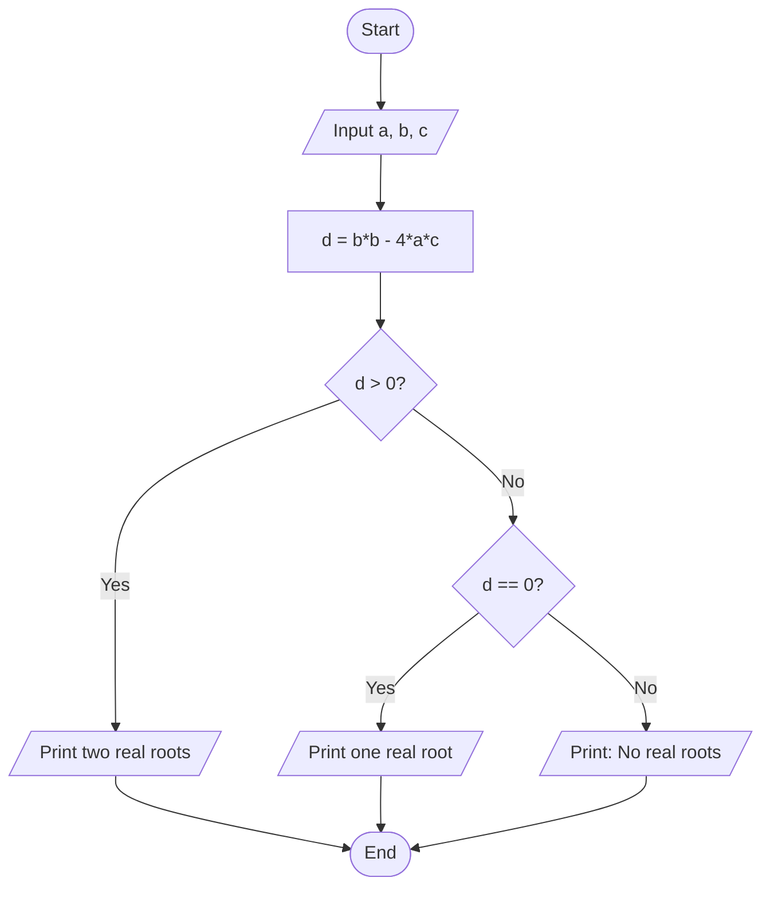

#### সি প্রোগ্রাম

```c
#include <stdio.h>
#include <math.h>

int main() {
    float a, b, c, d, r1, r2;
    printf("Enter a, b, c: ");
    scanf("%f %f %f", &a, &b, &c);

    d = b * b - 4 * a * c;

    if (d > 0) {
        r1 = (-b + sqrt(d)) / (2 * a);
        r2 = (-b - sqrt(d)) / (2 * a);
        printf("Root 1 = %.2f\nRoot 2 = %.2f\n", r1, r2);
    } else if (d == 0) {
        r1 = -b / (2 * a);
        printf("Root = %.2f\n", r1);
    } else {
        printf("No real roots.\n");
    }

    return 0;
}
```

</details>

---

<details>
<summary><b>প্রশ্ন ৭৮ — ভগ্নাংশ সংখ্যার যোগফল নির্ণয়</b></summary>

### Program: Find Sum of Two Fractions

#### অ্যালগরিদম

ধাপ ১: প্রোগ্রাম শুরু কর।

ধাপ ২: `n1`, `d1`, `n2`, `d2`, `rn`, `rd` ভেরিয়েবল ঘোষণা কর।

ধাপ ৩: প্রথম ভগ্নাংশের লব ও হর ইনপুট নাও।

ধাপ ৪: দ্বিতীয় ভগ্নাংশের লব ও হর ইনপুট নাও।

ধাপ ৫: `rn = n1*d2 + n2*d1` এবং `rd = d1*d2` হিসাব কর।

ধাপ ৬: ফলাফল `rn/rd` প্রদর্শন কর।

ধাপ ৭: প্রোগ্রাম শেষ কর।

#### ফ্লোচার্ট

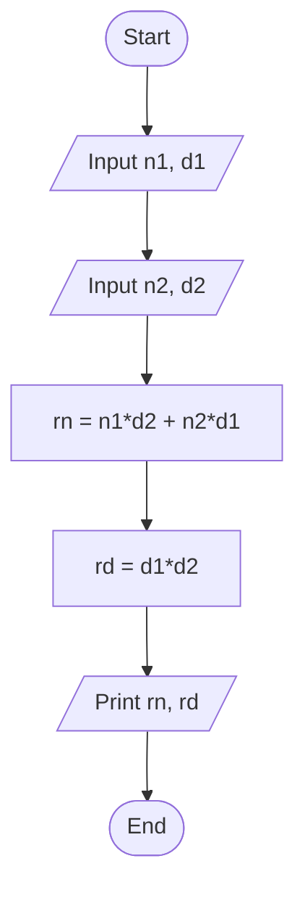

#### সি প্রোগ্রাম

```c
#include <stdio.h>

int main() {
    int n1, d1, n2, d2, rn, rd;
    printf("Enter first fraction (numerator denominator): ");
    scanf("%d %d", &n1, &d1);
    printf("Enter second fraction (numerator denominator): ");
    scanf("%d %d", &n2, &d2);

    rn = n1 * d2 + n2 * d1;
    rd = d1 * d2;

    printf("Sum = %d/%d\n", rn, rd);

    return 0;
}
```

</details>

---

## Type 2 — Decision Making

| # | Program |
|:-:|:--------|
| ৩৮ | ভোটার নির্ণয় |
| ৩৯ | শূন্য / ধনাত্মক / ঋণাত্মক |
| ৪০ | শূন্য / জোড় / বিজোড় |
| ৪১ | তিনটি সংখ্যার মধ্যে বড় |
| ৪২ | তিনটি সংখ্যার মধ্যে ছোট |
| ৪৩ | অধিবর্ষ নির্ণয় |
| ৭৭ | গ্রেড নির্ণয় |

---

<details>
<summary><b>প্রশ্ন ৩৮ — ভোটার নির্ণয়</b></summary>

### Program: Determine Voter Eligibility

#### অ্যালগরিদম

ধাপ ১: প্রোগ্রাম শুরু কর।

ধাপ ২: `age` ভেরিয়েবল ঘোষণা কর।

ধাপ ৩: বয়স ইনপুট নাও।

ধাপ ৪: যদি `age >= 18` হয়, তবে "ভোটার" প্রদর্শন কর।

ধাপ ৫: অন্যথায় "ভোটার নয়" প্রদর্শন কর।

ধাপ ৬: প্রোগ্রাম শেষ কর।

#### ফ্লোচার্ট

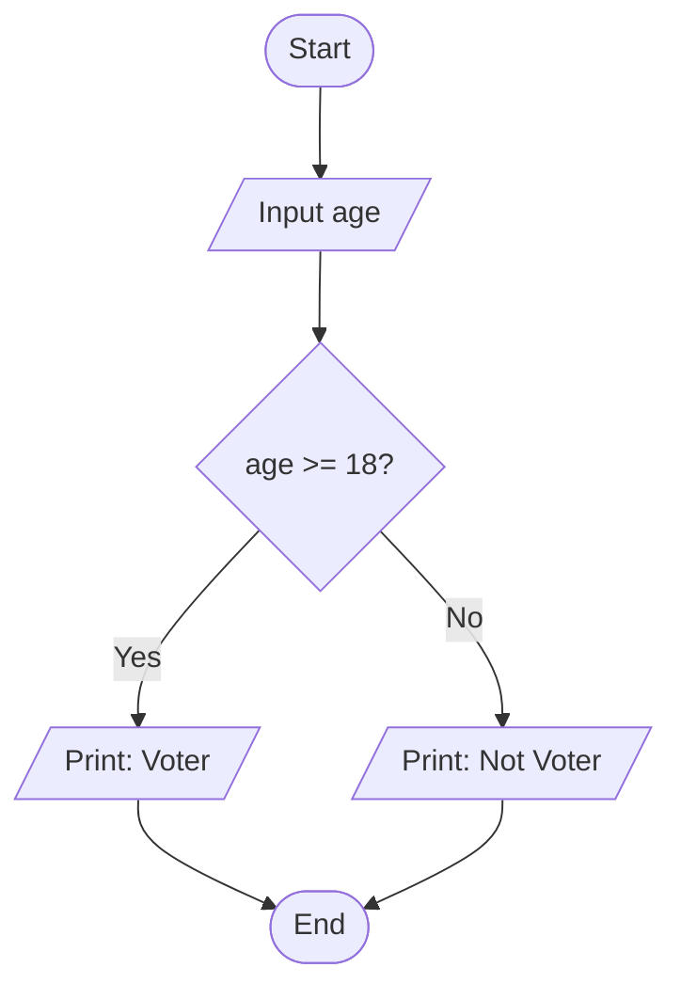

#### সি প্রোগ্রাম

```c
#include <stdio.h>

int main() {
    int age;
    printf("Enter age: ");
    scanf("%d", &age);

    if (age >= 18)
        printf("You are a Voter.\n");
    else
        printf("You are not a Voter.\n");

    return 0;
}
```

</details>

---

<details>
<summary><b>প্রশ্ন ৩৯ — শূন্য, ধনাত্মক নাকি ঋণাত্মক নির্ণয়</b></summary>

### Program: Check Zero, Positive or Negative

#### অ্যালগরিদম

ধাপ ১: প্রোগ্রাম শুরু কর।

ধাপ ২: `num` ভেরিয়েবল ঘোষণা কর।

ধাপ ৩: সংখ্যা ইনপুট নাও।

ধাপ ৪: যদি `num > 0` হয়, তবে "Positive" প্রদর্শন কর।

ধাপ ৫: যদি `num < 0` হয়, তবে "Negative" প্রদর্শন কর।

ধাপ ৬: অন্যথায় "Zero" প্রদর্শন কর।

ধাপ ৭: প্রোগ্রাম শেষ কর।

#### ফ্লোচার্ট

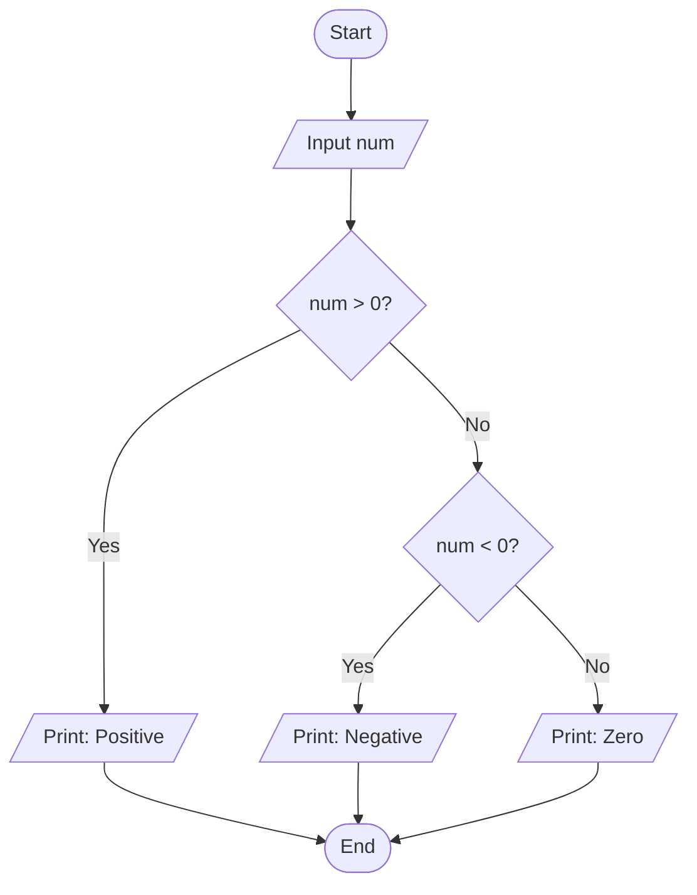

#### সি প্রোগ্রাম

```c
#include <stdio.h>

int main() {
    float num;
    printf("Enter a number: ");
    scanf("%f", &num);

    if (num > 0)
        printf("Positive\n");
    else if (num < 0)
        printf("Negative\n");
    else
        printf("Zero\n");

    return 0;
}
```

</details>

---

<details>
<summary><b>প্রশ্ন ৪০ — শূন্য, জোড় নাকি বিজোড় নির্ণয়</b></summary>

### Program: Check Zero, Even or Odd

#### অ্যালগরিদম

ধাপ ১: প্রোগ্রাম শুরু কর।

ধাপ ২: `num` ভেরিয়েবল ঘোষণা কর।

ধাপ ৩: সংখ্যা ইনপুট নাও।

ধাপ ৪: যদি `num == 0` হয়, তবে "Zero" প্রদর্শন কর।

ধাপ ৫: যদি `num % 2 == 0` হয়, তবে "Even" প্রদর্শন কর।

ধাপ ৬: অন্যথায় "Odd" প্রদর্শন কর।

ধাপ ৭: প্রোগ্রাম শেষ কর।

#### ফ্লোচার্ট

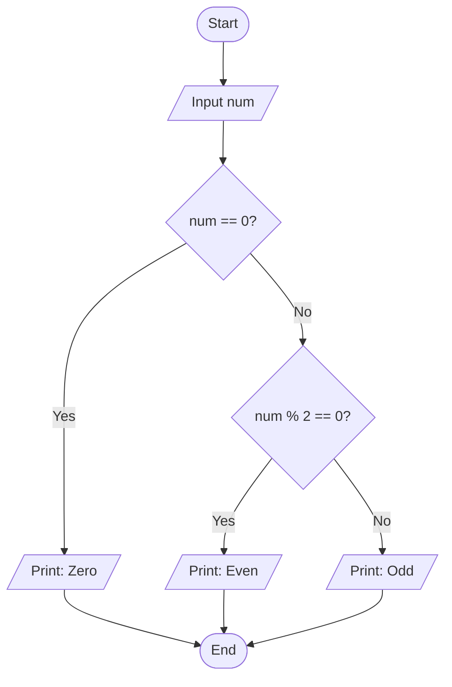

#### সি প্রোগ্রাম

```c
#include <stdio.h>

int main() {
    int num;
    printf("Enter a number: ");
    scanf("%d", &num);

    if (num == 0)
        printf("Zero\n");
    else if (num % 2 == 0)
        printf("Even\n");
    else
        printf("Odd\n");

    return 0;
}
```

</details>

---

<details>
<summary><b>প্রশ্ন ৪১ — তিনটি সংখ্যার মধ্যে বড় সংখ্যা নির্ণয়</b></summary>

### Program: Find the Largest Among Three Numbers

#### অ্যালগরিদম

ধাপ ১: প্রোগ্রাম শুরু কর।

ধাপ ২: `a`, `b`, `c` ভেরিয়েবল ঘোষণা কর।

ধাপ ৩: তিনটি সংখ্যা ইনপুট নাও।

ধাপ ৪: যদি `a >= b` এবং `a >= c` হয়, তবে `a` বড়।

ধাপ ৫: যদি `b >= a` এবং `b >= c` হয়, তবে `b` বড়।

ধাপ ৬: অন্যথায় `c` বড়।

ধাপ ৭: ফলাফল প্রদর্শন কর।

ধাপ ৮: প্রোগ্রাম শেষ কর।

#### ফ্লোচার্ট

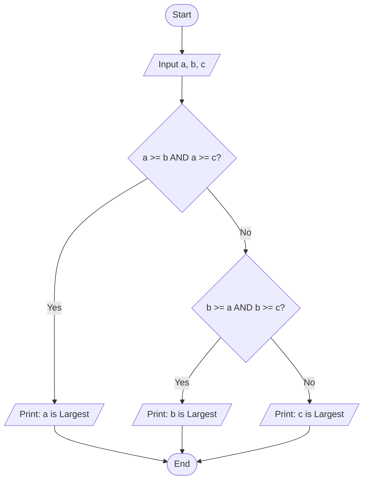

#### সি প্রোগ্রাম

```c
#include <stdio.h>

int main() {
    float a, b, c;
    printf("Enter three numbers: ");
    scanf("%f %f %f", &a, &b, &c);

    if (a >= b && a >= c)
        printf("Largest = %.2f\n", a);
    else if (b >= a && b >= c)
        printf("Largest = %.2f\n", b);
    else
        printf("Largest = %.2f\n", c);

    return 0;
}
```

</details>

---

<details>
<summary><b>প্রশ্ন ৪২ — তিনটি সংখ্যার মধ্যে ছোট সংখ্যা নির্ণয়</b></summary>

### Program: Find the Smallest Among Three Numbers

#### অ্যালগরিদম

ধাপ ১: প্রোগ্রাম শুরু কর।

ধাপ ২: `a`, `b`, `c` ভেরিয়েবল ঘোষণা কর।

ধাপ ৩: তিনটি সংখ্যা ইনপুট নাও।

ধাপ ৪: যদি `a <= b` এবং `a <= c` হয়, তবে `a` ছোট।

ধাপ ৫: যদি `b <= a` এবং `b <= c` হয়, তবে `b` ছোট।

ধাপ ৬: অন্যথায় `c` ছোট।

ধাপ ৭: ফলাফল প্রদর্শন কর।

ধাপ ৮: প্রোগ্রাম শেষ কর।

#### ফ্লোচার্ট


#### সি প্রোগ্রাম

```c
#include <stdio.h>

int main() {
    float a, b, c;
    printf("Enter three numbers: ");
    scanf("%f %f %f", &a, &b, &c);

    if (a <= b && a <= c)
        printf("Smallest = %.2f\n", a);
    else if (b <= a && b <= c)
        printf("Smallest = %.2f\n", b);
    else
        printf("Smallest = %.2f\n", c);

    return 0;
}
```

</details>

---

<details>
<summary><b>প্রশ্ন ৪৩ — অধিবর্ষ (Leap Year) নির্ণয়</b></summary>

### Program: Check Leap Year

#### অ্যালগরিদম

ধাপ ১: প্রোগ্রাম শুরু কর।

ধাপ ২: `year` ভেরিয়েবল ঘোষণা কর।

ধাপ ৩: বছর ইনপুট নাও।

ধাপ ৪: যদি `year` ৪০০ দ্বারা বিভাজ্য হয়, তবে অধিবর্ষ।

ধাপ ৫: যদি `year` ১০০ দ্বারা বিভাজ্য হয়, তবে অধিবর্ষ নয়।

ধাপ ৬: যদি `year` ৪ দ্বারা বিভাজ্য হয়, তবে অধিবর্ষ।

ধাপ ৭: অন্যথায় অধিবর্ষ নয়।

ধাপ ৮: প্রোগ্রাম শেষ কর।

#### ফ্লোচার্ট

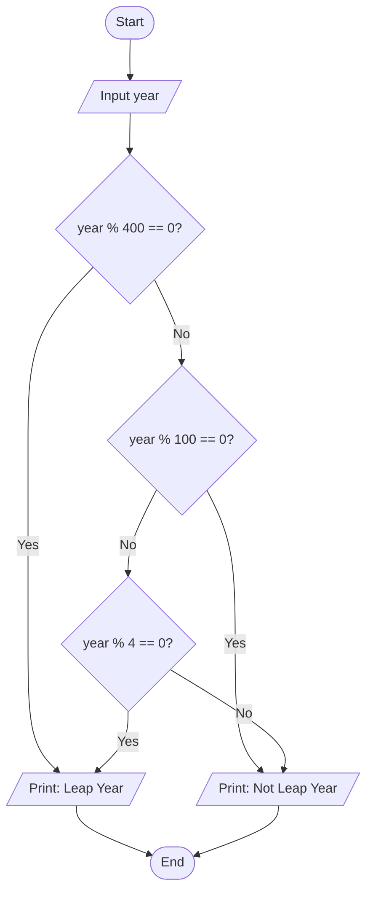

#### সি প্রোগ্রাম

```c
#include <stdio.h>

int main() {
    int year;
    printf("Enter year: ");
    scanf("%d", &year);

    if ((year % 400 == 0) || (year % 100 != 0 && year % 4 == 0))
        printf("%d is a Leap Year.\n", year);
    else
        printf("%d is not a Leap Year.\n", year);

    return 0;
}
```

</details>

---

<details>
<summary><b>প্রশ্ন ৭৭ — পরীক্ষায় প্রাপ্ত নম্বর অনুযায়ী গ্রেড নির্ণয়</b></summary>

### Program: Determine Grade from Marks

#### অ্যালগরিদম

ধাপ ১: প্রোগ্রাম শুরু কর।

ধাপ ২: `marks` ভেরিয়েবল ঘোষণা কর।

ধাপ ৩: নম্বর ইনপুট নাও।

ধাপ ৪: `marks >= 80` হলে "A+", `>= 70` হলে "A", `>= 60` হলে "A-", `>= 50` হলে "B", `>= 40` হলে "C", `>= 33` হলে "D"।

ধাপ ৫: অন্যথায় "F (Fail)" প্রদর্শন কর।

ধাপ ৬: প্রোগ্রাম শেষ কর।

#### ফ্লোচার্ট

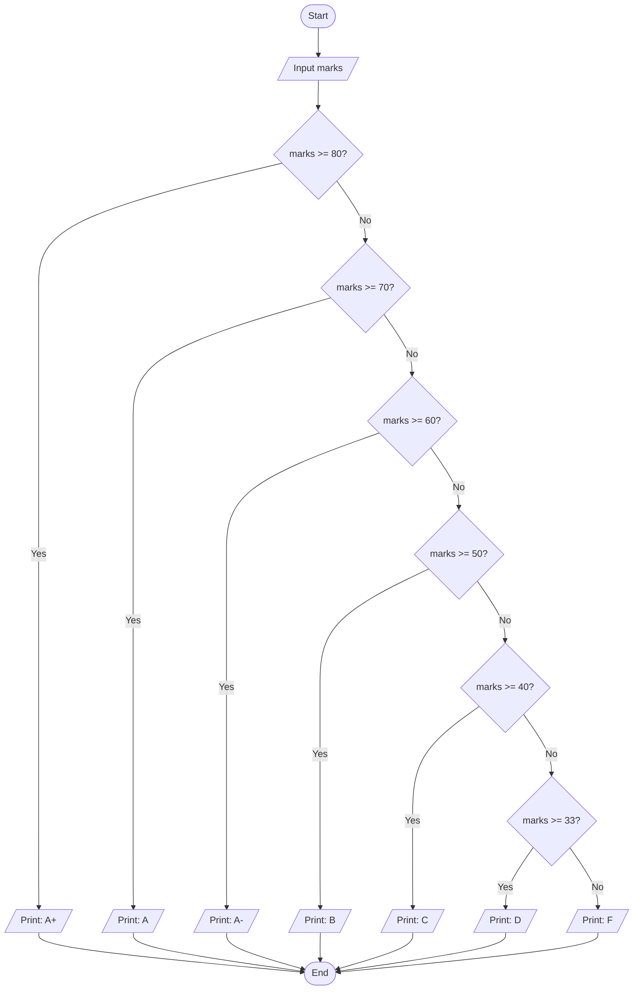

#### সি প্রোগ্রাম

```c
#include <stdio.h>

int main() {
    float marks;
    printf("Enter marks: ");
    scanf("%f", &marks);

    if (marks >= 80)
        printf("Grade: A+\n");
    else if (marks >= 70)
        printf("Grade: A\n");
    else if (marks >= 60)
        printf("Grade: A-\n");
    else if (marks >= 50)
        printf("Grade: B\n");
    else if (marks >= 40)
        printf("Grade: C\n");
    else if (marks >= 33)
        printf("Grade: D\n");
    else
        printf("Grade: F (Fail)\n");

    return 0;
}
```

</details>

---

## Type 3 — Loop + Summation

| # | Program |
|:-:|:--------|
| ৪৭ | 1+2+3+...+n |
| ৪৮ | 1+3+5+...+n (বিজোড়) |
| ৪৯ | 2+4+6+...+n (জোড়) |
| ৫০ | 1²+2²+3²+...+N² |
| ৫১ | 100²+95²+90²+...+10² |
| ৫২ | 99²+88²+77²+...+11² |
| ৫৩ | 1000+950+900+...+50 |
| ৫৪ | 1.2+2.3+3.4+...+n(n+1) |
| ৫৫ | 1^1+2^2+3^3+...+N^N |
| ৫৬ | 2²+4²+8²+... (x2 step) |
| ৫৭ | 3²+9²+27²+... (x3 step) |
| ৫৮ | 1³+2³+3³+...+N³ |
| ৫৯ | 1+1/2²+1/3³+...+1/n^n |
| ৬১ | 1x2+2x3+...+Nx(N+1) |

---

<details>
<summary><b>প্রশ্ন ৪৭ — 1+2+3+...+n ধারার যোগফল</b></summary>

### Program: Sum of Series 1+2+3+...+n

#### অ্যালগরিদম

ধাপ ১: প্রোগ্রাম শুরু কর।

ধাপ ২: `n`, `i`, `sum=0` ভেরিয়েবল ঘোষণা কর।

ধাপ ৩: `n` এর মান ইনপুট নাও।

ধাপ ৪: `i=1` থেকে `n` পর্যন্ত লুপ চালাও এবং `sum = sum + i` কর।

ধাপ ৫: `sum` প্রদর্শন কর।

ধাপ ৬: প্রোগ্রাম শেষ কর।

#### ফ্লোচার্ট

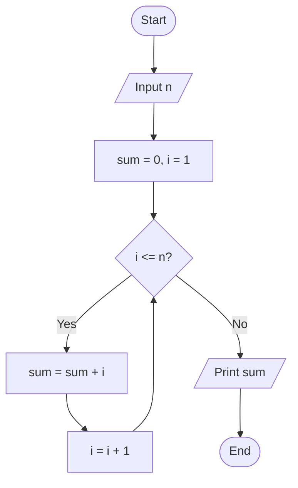

#### সি প্রোগ্রাম

```c
#include <stdio.h>

int main() {
    int n, i, sum = 0;
    printf("Enter n: ");
    scanf("%d", &n);

    for (i = 1; i <= n; i++)
        sum += i;

    printf("Sum = %d\n", sum);

    return 0;
}
```

</details>

---

<details>
<summary><b>প্রশ্ন ৪৮ — 1+3+5+...+n বিজোড় সংখ্যার যোগফল</b></summary>

### Program: Sum of Odd Numbers 1+3+5+...+n

#### অ্যালগরিদম

ধাপ ১: প্রোগ্রাম শুরু কর।

ধাপ ২: `n`, `i`, `sum=0` ভেরিয়েবল ঘোষণা কর।

ধাপ ৩: `n` এর মান ইনপুট নাও।

ধাপ ৪: `i=1` থেকে `n` পর্যন্ত ২ করে বৃদ্ধি করে লুপ চালাও এবং `sum = sum + i` কর।

ধাপ ৫: `sum` প্রদর্শন কর।

ধাপ ৬: প্রোগ্রাম শেষ কর।

#### ফ্লোচার্ট


#### সি প্রোগ্রাম

```c
#include <stdio.h>

int main() {
    int n, i, sum = 0;
    printf("Enter n: ");
    scanf("%d", &n);

    for (i = 1; i <= n; i += 2)
        sum += i;

    printf("Sum = %d\n", sum);

    return 0;
}
```

</details>

---

<details>
<summary><b>প্রশ্ন ৪৯ — 2+4+6+...+n জোড় সংখ্যার যোগফল</b></summary>

### Program: Sum of Even Numbers 2+4+6+...+n

#### অ্যালগরিদম

ধাপ ১: প্রোগ্রাম শুরু কর।

ধাপ ২: `n`, `i`, `sum=0` ভেরিয়েবল ঘোষণা কর।

ধাপ ৩: `n` এর মান ইনপুট নাও।

ধাপ ৪: `i=2` থেকে `n` পর্যন্ত ২ করে বৃদ্ধি করে লুপ চালাও এবং `sum = sum + i` কর।

ধাপ ৫: `sum` প্রদর্শন কর।

ধাপ ৬: প্রোগ্রাম শেষ কর।

#### ফ্লোচার্ট


#### সি প্রোগ্রাম

```c
#include <stdio.h>

int main() {
    int n, i, sum = 0;
    printf("Enter n: ");
    scanf("%d", &n);

    for (i = 2; i <= n; i += 2)
        sum += i;

    printf("Sum = %d\n", sum);

    return 0;
}
```

</details>

---

<details>
<summary><b>প্রশ্ন ৫০ — 1²+2²+3²+...+N² ধারার যোগফল</b></summary>

### Program: Sum of Squares

#### অ্যালগরিদম

ধাপ ১: প্রোগ্রাম শুরু কর।

ধাপ ২: `n`, `i`, `sum=0` ভেরিয়েবল ঘোষণা কর।

ধাপ ৩: `n` এর মান ইনপুট নাও।

ধাপ ৪: `i=1` থেকে `n` পর্যন্ত লুপ চালাও এবং `sum = sum + i*i` কর।

ধাপ ৫: `sum` প্রদর্শন কর।

ধাপ ৬: প্রোগ্রাম শেষ কর।

#### ফ্লোচার্ট

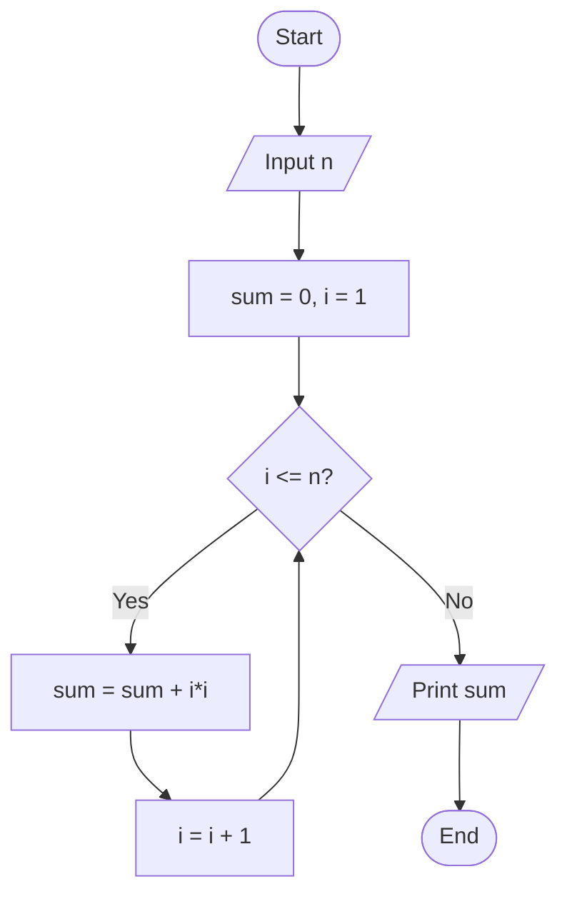

#### সি প্রোগ্রাম

```c
#include <stdio.h>

int main() {
    int n, i, sum = 0;
    printf("Enter n: ");
    scanf("%d", &n);

    for (i = 1; i <= n; i++)
        sum += i * i;

    printf("Sum = %d\n", sum);

    return 0;
}
```

</details>

---

<details>
<summary><b>প্রশ্ন ৫১ — 100²+95²+90²+...+10²</b></summary>

### Program: Sum of Series (100 to 10, step -5, squared)

#### অ্যালগরিদম

ধাপ ১: প্রোগ্রাম শুরু কর।

ধাপ ২: `i`, `sum=0` ভেরিয়েবল ঘোষণা কর।

ধাপ ৩: `i=100` থেকে `10` পর্যন্ত ৫ করে কমিয়ে লুপ চালাও এবং `sum = sum + i*i` কর।

ধাপ ৪: `sum` প্রদর্শন কর।

ধাপ ৫: প্রোগ্রাম শেষ কর।

#### ফ্লোচার্ট

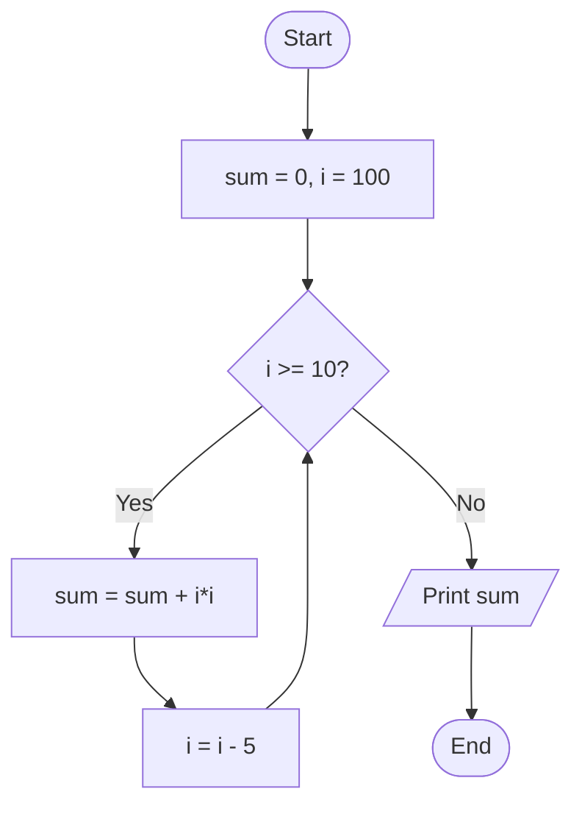

#### সি প্রোগ্রাম

```c
#include <stdio.h>

int main() {
    int i, sum = 0;

    for (i = 100; i >= 10; i -= 5)
        sum += i * i;

    printf("Sum = %d\n", sum);

    return 0;
}
```

</details>

---

<details>
<summary><b>প্রশ্ন ৫২ — 99²+88²+77²+...+11²</b></summary>

### Program: Sum of Series (99 to 11, step -11, squared)

#### অ্যালগরিদম

ধাপ ১: প্রোগ্রাম শুরু কর।

ধাপ ২: `i`, `sum=0` ভেরিয়েবল ঘোষণা কর।

ধাপ ৩: `i=99` থেকে `i > 0` পর্যন্ত ১১ করে কমিয়ে লুপ চালাও এবং `sum = sum + i*i` কর।

ধাপ ৪: `sum` প্রদর্শন কর।

ধাপ ৫: প্রোগ্রাম শেষ কর।

#### ফ্লোচার্ট

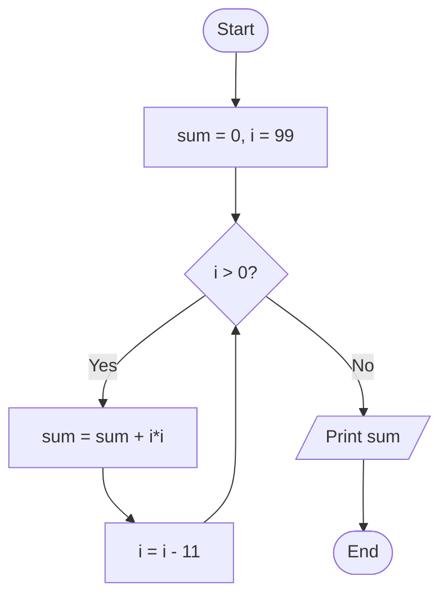

#### সি প্রোগ্রাম

```c
#include <stdio.h>

int main() {
    int i, sum = 0;

    for (i = 99; i > 0; i -= 11)
        sum += i * i;

    printf("Sum = %d\n", sum);

    return 0;
}
```

</details>

---

<details>
<summary><b>প্রশ্ন ৫৩ — 1000+950+900+...+50</b></summary>

### Program: Sum of Series (1000 to 50, step -50)

#### অ্যালগরিদম

ধাপ ১: প্রোগ্রাম শুরু কর।

ধাপ ২: `i`, `sum=0` ভেরিয়েবল ঘোষণা কর।

ধাপ ৩: `i=1000` থেকে `i >= 22` পর্যন্ত ৫০ করে কমিয়ে লুপ চালাও এবং `sum = sum + i` কর।

ধাপ ৪: `sum` প্রদর্শন কর।

ধাপ ৫: প্রোগ্রাম শেষ কর।

#### ফ্লোচার্ট

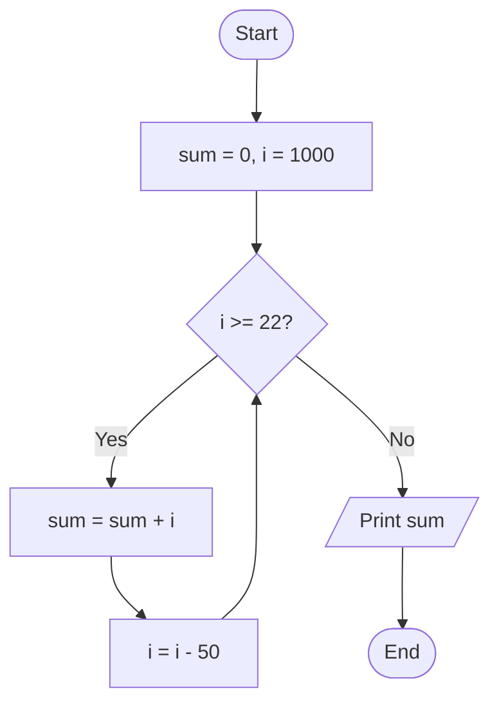

#### সি প্রোগ্রাম

```c
#include <stdio.h>

int main() {
    int i, sum = 0;

    for (i = 1000; i >= 22; i -= 50)
        sum += i;

    printf("Sum = %d\n", sum);

    return 0;
}
```

</details>

---

<details>
<summary><b>প্রশ্ন ৫৪ — 1.2 + 2.3 + 3.4 + ... + n(n+1)</b></summary>

### Program: Sum of Series i x (i+1)

#### অ্যালগরিদম

ধাপ ১: প্রোগ্রাম শুরু কর।

ধাপ ২: `n`, `i`, `sum=0` ভেরিয়েবল ঘোষণা কর।

ধাপ ৩: `n` এর মান ইনপুট নাও।

ধাপ ৪: `i=1` থেকে `n` পর্যন্ত লুপ চালাও এবং `sum = sum + i*(i+1)` কর।

ধাপ ৫: `sum` প্রদর্শন কর।

ধাপ ৬: প্রোগ্রাম শেষ কর।

#### ফ্লোচার্ট

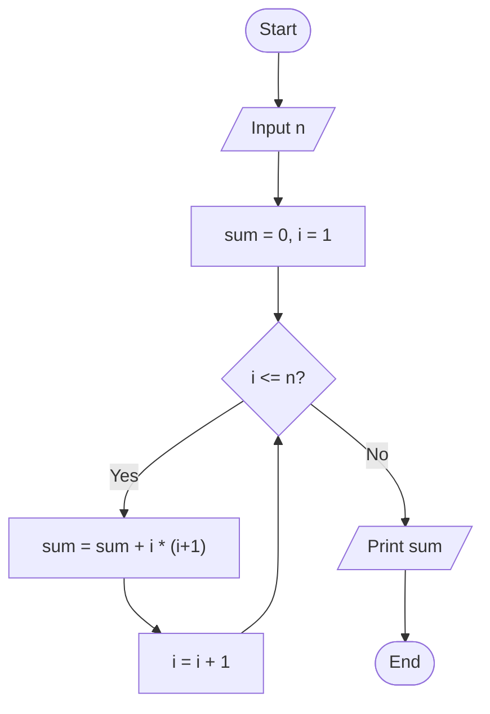

#### সি প্রোগ্রাম

```c
#include <stdio.h>

int main() {
    int n, i, sum = 0;
    printf("Enter n: ");
    scanf("%d", &n);

    for (i = 1; i <= n; i++)
        sum += i * (i + 1);

    printf("Sum = %d\n", sum);

    return 0;
}
```

</details>

---

<details>
<summary><b>প্রশ্ন ৫৫ — 1^1 + 2^2 + 3^3 + ... + N^N</b></summary>

### Program: Sum of Series i^i

#### অ্যালগরিদম

ধাপ ১: প্রোগ্রাম শুরু কর।

ধাপ ২: `n`, `i`, `sum=0` ভেরিয়েবল ঘোষণা কর।

ধাপ ৩: `n` এর মান ইনপুট নাও।

ধাপ ৪: `i=1` থেকে `n` পর্যন্ত লুপ চালাও এবং `sum = sum + pow(i, i)` কর।

ধাপ ৫: `sum` প্রদর্শন কর।

ধাপ ৬: প্রোগ্রাম শেষ কর।

#### ফ্লোচার্ট

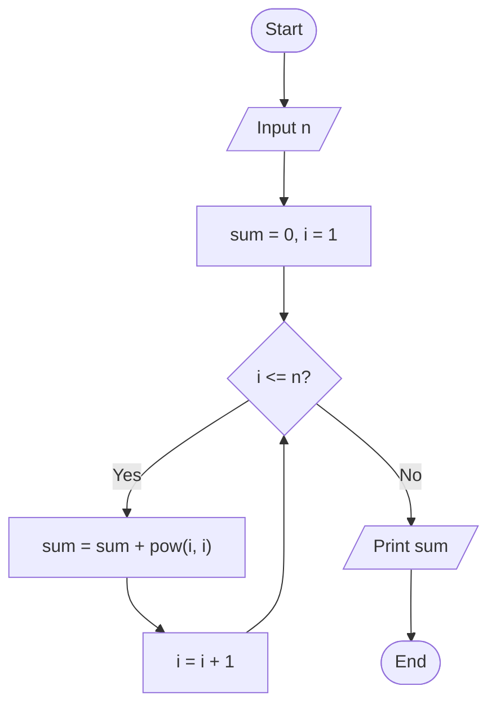

#### সি প্রোগ্রাম

```c
#include <stdio.h>
#include <math.h>

int main() {
    int n, i;
    double sum = 0;
    printf("Enter n: ");
    scanf("%d", &n);

    for (i = 1; i <= n; i++)
        sum += pow(i, i);

    printf("Sum = %.0lf\n", sum);

    return 0;
}
```

</details>

---

<details>
<summary><b>প্রশ্ন ৫৬ — 2²+4²+8²+... (x2 step, squared)</b></summary>

### Program: Sum of Squares of Powers of 2

#### অ্যালগরিদম

ধাপ ১: প্রোগ্রাম শুরু কর।

ধাপ ২: `n`, `i`, `sum=0` ভেরিয়েবল ঘোষণা কর।

ধাপ ৩: `n` এর মান ইনপুট নাও।

ধাপ ৪: `i=2` থেকে `i <= n` পর্যন্ত `i = i*2` করে লুপ চালাও এবং `sum = sum + i*i` কর।

ধাপ ৫: `sum` প্রদর্শন কর।

ধাপ ৬: প্রোগ্রাম শেষ কর।

#### ফ্লোচার্ট


#### সি প্রোগ্রাম

```c
#include <stdio.h>

int main() {
    int n, sum = 0;
    long long i;
    printf("Enter n: ");
    scanf("%d", &n);

    for (i = 2; i <= n; i *= 2)
        sum += i * i;

    printf("Sum = %d\n", sum);

    return 0;
}
```

</details>

---

<details>
<summary><b>প্রশ্ন ৫৭ — 3²+9²+27²+... (x3 step, squared)</b></summary>

### Program: Sum of Squares of Powers of 3

#### অ্যালগরিদম

ধাপ ১: প্রোগ্রাম শুরু কর।

ধাপ ২: `n`, `i`, `sum=0` ভেরিয়েবল ঘোষণা কর।

ধাপ ৩: `n` এর মান ইনপুট নাও।

ধাপ ৪: `i=3` থেকে `i <= n` পর্যন্ত `i = i*3` করে লুপ চালাও এবং `sum = sum + i*i` কর।

ধাপ ৫: `sum` প্রদর্শন কর।

ধাপ ৬: প্রোগ্রাম শেষ কর।

#### ফ্লোচার্ট

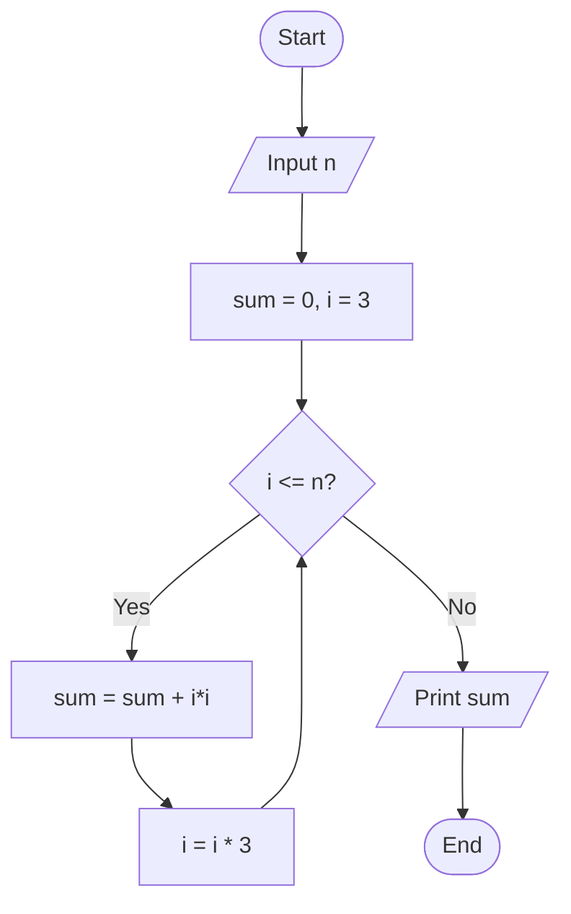

#### সি প্রোগ্রাম

```c
#include <stdio.h>

int main() {
    int n, sum = 0;
    long long i;
    printf("Enter n: ");
    scanf("%d", &n);

    for (i = 3; i <= n; i *= 3)
        sum += i * i;

    printf("Sum = %d\n", sum);

    return 0;
}
```

</details>

---

<details>
<summary><b>প্রশ্ন ৫৮ — 1³+2³+3³+...+N³ ধারার যোগফল</b></summary>

### Program: Sum of Cubes

#### অ্যালগরিদম

ধাপ ১: প্রোগ্রাম শুরু কর।

ধাপ ২: `n`, `i`, `sum=0` ভেরিয়েবল ঘোষণা কর।

ধাপ ৩: `n` এর মান ইনপুট নাও।

ধাপ ৪: `i=1` থেকে `n` পর্যন্ত লুপ চালাও এবং `sum = sum + i*i*i` কর।

ধাপ ৫: `sum` প্রদর্শন কর।

ধাপ ৬: প্রোগ্রাম শেষ কর।

#### ফ্লোচার্ট

```mermaid
flowchart TD
    A([Start]) --> B[/"Input n"/]
    B --> C["sum = 0, i = 1"]
    C --> D{"i <= n?"}
    D -- Yes --> E["sum = sum + i*i*i"]
    E --> F["i = i + 1"]
    F --> D
    D -- No --> G[/"Print sum"/]
    G --> H([End])
```

#### সি প্রোগ্রাম

```c
#include <stdio.h>

int main() {
    int n, i, sum = 0;
    printf("Enter n: ");
    scanf("%d", &n);

    for (i = 1; i <= n; i++)
        sum += i * i * i;

    printf("Sum = %d\n", sum);

    return 0;
}
```

</details>

---

<details>
<summary><b>প্রশ্ন ৫৯ — 1 + 1/2² + 1/3³ + ... + 1/n^n</b></summary>

### Program: Sum of Reciprocal Powers

#### অ্যালগরিদম

ধাপ ১: প্রোগ্রাম শুরু কর।

ধাপ ২: `n`, `i`, `sum=0.0` ভেরিয়েবল ঘোষণা কর।

ধাপ ৩: `n` এর মান ইনপুট নাও।

ধাপ ৪: `i=1` থেকে `n` পর্যন্ত লুপ চালাও এবং `sum = sum + 1/pow(i, i)` কর।

ধাপ ৫: `sum` প্রদর্শন কর।

ধাপ ৬: প্রোগ্রাম শেষ কর।

#### ফ্লোচার্ট

```mermaid
flowchart TD
    A([Start]) --> B[/"Input n"/]
    B --> C["sum = 0.0, i = 1"]
    C --> D{"i <= n?"}
    D -- Yes --> E["sum = sum + 1.0 / pow(i, i)"]
    E --> F["i = i + 1"]
    F --> D
    D -- No --> G[/"Print sum"/]
    G --> H([End])
```

#### সি প্রোগ্রাম

```c
#include <stdio.h>
#include <math.h>

int main() {
    int n, i;
    double sum = 0.0;
    printf("Enter n: ");
    scanf("%d", &n);

    for (i = 1; i <= n; i++)
        sum += 1.0 / pow(i, i);

    printf("Sum = %.6lf\n", sum);

    return 0;
}
```

</details>

---

<details>
<summary><b>প্রশ্ন ৬১ — 1x2 + 2x3 + 3x4 + ... + Nx(N+1)</b></summary>

### Program: Sum of Series i x (i+1)

#### অ্যালগরিদম

ধাপ ১: প্রোগ্রাম শুরু কর।

ধাপ ২: `n`, `i`, `sum=0` ভেরিয়েবল ঘোষণা কর।

ধাপ ৩: `n` এর মান ইনপুট নাও।

ধাপ ৪: `i=1` থেকে `n` পর্যন্ত লুপ চালাও এবং `sum = sum + i*(i+1)` কর।

ধাপ ৫: `sum` প্রদর্শন কর।

ধাপ ৬: প্রোগ্রাম শেষ কর।

#### ফ্লোচার্ট

```mermaid
flowchart TD
    A([Start]) --> B[/"Input n"/]
    B --> C["sum = 0, i = 1"]
    C --> D{"i <= n?"}
    D -- Yes --> E["sum = sum + i * (i+1)"]
    E --> F["i = i + 1"]
    F --> D
    D -- No --> G[/"Print sum"/]
    G --> H([End])
```

#### সি প্রোগ্রাম

```c
#include <stdio.h>

int main() {
    int n, i, sum = 0;
    printf("Enter n: ");
    scanf("%d", &n);

    for (i = 1; i <= n; i++)
        sum += i * (i + 1);

    printf("Sum = %d\n", sum);

    return 0;
}
```

</details>

---

## Type 4 — Loop + Display

| # | Program |
|:-:|:--------|
| ৬২ | জোড় ও বিজোড় প্রদর্শন (1-100) |
| ৬৩ | 1, 2, 3, ..., n ধারা প্রদর্শন |
| ৬৪ | নামতা (Multiplication Table) |
| ৭৫ | A থেকে Z প্রদর্শন |

---

<details>
<summary><b>প্রশ্ন ৬২ — ১ থেকে ১০০ এর মধ্যে জোড় ও বিজোড় প্রদর্শন</b></summary>

### Program: Display Even and Odd Numbers 1 to 100

#### অ্যালগরিদম

ধাপ ১: প্রোগ্রাম শুরু কর।

ধাপ ২: `i` ভেরিয়েবল ঘোষণা কর।

ধাপ ৩: `i=2` থেকে `100` পর্যন্ত ২ করে বৃদ্ধি করে জোড় সংখ্যা প্রদর্শন কর।

ধাপ ৪: `i=1` থেকে `100` পর্যন্ত ২ করে বৃদ্ধি করে বিজোড় সংখ্যা প্রদর্শন কর।

ধাপ ৫: প্রোগ্রাম শেষ কর।

#### ফ্লোচার্ট

```mermaid
flowchart TD
    A([Start]) --> B["i = 2"]
    B --> C{"i <= 100?"}
    C -- Yes --> D[/"Print i as Even"/]
    D --> E["i = i + 2"]
    E --> C
    C -- No --> F["i = 1"]
    F --> G{"i <= 100?"}
    G -- Yes --> H[/"Print i as Odd"/]
    H --> I["i = i + 2"]
    I --> G
    G -- No --> J([End])
```

#### সি প্রোগ্রাম

```c
#include <stdio.h>

int main() {
    int i;

    printf("Even numbers: ");
    for (i = 2; i <= 100; i += 2)
        printf("%d ", i);

    printf("\nOdd numbers: ");
    for (i = 1; i <= 100; i += 2)
        printf("%d ", i);

    printf("\n");

    return 0;
}
```

</details>

---

<details>
<summary><b>প্রশ্ন ৬৩ — ১, ২, ৩, ..., n ধারা প্রদর্শন</b></summary>

### Program: Display Series 1, 2, 3, ..., n

#### অ্যালগরিদম

ধাপ ১: প্রোগ্রাম শুরু কর।

ধাপ ২: `n`, `i` ভেরিয়েবল ঘোষণা কর।

ধাপ ৩: `n` এর মান ইনপুট নাও।

ধাপ ৪: `i=1` থেকে `n` পর্যন্ত লুপ চালাও এবং `i` প্রদর্শন কর।

ধাপ ৫: প্রোগ্রাম শেষ কর।

#### ফ্লোচার্ট

```mermaid
flowchart TD
    A([Start]) --> B[/"Input n"/]
    B --> C["i = 1"]
    C --> D{"i <= n?"}
    D -- Yes --> E[/"Print i"/]
    E --> F["i = i + 1"]
    F --> D
    D -- No --> G([End])
```

#### সি প্রোগ্রাম

```c
#include <stdio.h>

int main() {
    int n, i;
    printf("Enter n: ");
    scanf("%d", &n);

    for (i = 1; i <= n; i++)
        printf("%d ", i);

    printf("\n");

    return 0;
}
```

</details>

---

<details>
<summary><b>প্রশ্ন ৬৪ — যেকোনো সংখ্যার নামতা</b></summary>

### Program: Print Multiplication Table

#### অ্যালগরিদম

ধাপ ১: প্রোগ্রাম শুরু কর।

ধাপ ২: `num`, `i` ভেরিয়েবল ঘোষণা কর।

ধাপ ৩: সংখ্যা ইনপুট নাও।

ধাপ ৪: `i=1` থেকে `10` পর্যন্ত লুপ চালাও এবং `num x i` প্রদর্শন কর।

ধাপ ৫: প্রোগ্রাম শেষ কর।

#### ফ্লোচার্ট

```mermaid
flowchart TD
    A([Start]) --> B[/"Input num"/]
    B --> C["i = 1"]
    C --> D{"i <= 10?"}
    D -- Yes --> E[/"Print num x i = result"/]
    E --> F["i = i + 1"]
    F --> D
    D -- No --> G([End])
```

#### সি প্রোগ্রাম

```c
#include <stdio.h>

int main() {
    int num, i;
    printf("Enter a number: ");
    scanf("%d", &num);

    for (i = 1; i <= 10; i++)
        printf("%d x %d = %d\n", num, i, num * i);

    return 0;
}
```

</details>

---

<details>
<summary><b>প্রশ্ন ৭৫ — A হতে Z পর্যন্ত লেটার প্রদর্শন</b></summary>

### Program: Display Letters A to Z

#### অ্যালগরিদম

ধাপ ১: প্রোগ্রাম শুরু কর।

ধাপ ২: `ch` ক্যারেক্টার ভেরিয়েবল ঘোষণা কর।

ধাপ ৩: `ch='A'` থেকে `'Z'` পর্যন্ত লুপ চালাও এবং `ch` প্রদর্শন কর।

ধাপ ৪: প্রোগ্রাম শেষ কর।

#### ফ্লোচার্ট

```mermaid
flowchart TD
    A([Start]) --> B["ch = A"]
    B --> C{"ch <= Z?"}
    C -- Yes --> D[/"Print ch"/]
    D --> E["ch = ch + 1"]
    E --> C
    C -- No --> F([End])
```

#### সি প্রোগ্রাম

```c
#include <stdio.h>

int main() {
    char ch;

    for (ch = 'A'; ch <= 'Z'; ch++)
        printf("%c ", ch);

    printf("\n");

    return 0;
}
```

</details>

---

## Type 5 — Loop + Logic

| # | Program |
|:-:|:--------|
| ৪৪ | ল.সা.গু (LCM) |
| ৪৫ | গ.সা.গু (GCD/HCF) |
| ৪৬ | মৌলিক সংখ্যা |
| ৬০ | ফ্যাক্টরিয়াল |
| ৭০ | ঘাত নির্ণয় (লুপ) |
| ৭১ | ইন্টিজার উল্টো |
| ৭৪ | ৪ ডিজিট উল্টো |
| ৭৬ | পাওয়ার (pow ফাংশন) |

---

<details>
<summary><b>প্রশ্ন ৪৪ — ল.সা.গু (LCM) নির্ণয়</b></summary>

### Program: Find LCM of Two Numbers

#### অ্যালগরিদম

ধাপ ১: প্রোগ্রাম শুরু কর।

ধাপ ২: `a`, `b`, `lcm` ভেরিয়েবল ঘোষণা কর।

ধাপ ৩: দুটি সংখ্যা ইনপুট নাও।

ধাপ ৪: `lcm` = `a` ও `b` এর মধ্যে বড়টি ধরো।

ধাপ ৫: যতক্ষণ `lcm` উভয় সংখ্যা দ্বারা বিভাজ্য না হয়, ততক্ষণ `lcm` ১ করে বাড়াও।

ধাপ ৬: `lcm` প্রদর্শন কর।

ধাপ ৭: প্রোগ্রাম শেষ কর।

#### ফ্লোচার্ট

```mermaid
flowchart TD
    A([Start]) --> B[/"Input a, b"/]
    B --> C["lcm = max of a, b"]
    C --> D{"lcm%a==0 AND lcm%b==0?"}
    D -- Yes --> E[/"Print lcm"/]
    D -- No --> F["lcm = lcm + 1"]
    F --> D
    E --> G([End])
```

#### সি প্রোগ্রাম

```c
#include <stdio.h>

int main() {
    int a, b, lcm;
    printf("Enter two numbers: ");
    scanf("%d %d", &a, &b);

    lcm = (a > b) ? a : b;

    while (lcm % a != 0 || lcm % b != 0)
        lcm++;

    printf("LCM = %d\n", lcm);

    return 0;
}
```

</details>

---

<details>
<summary><b>প্রশ্ন ৪৫ — গ.সা.গু (GCD/HCF) নির্ণয়</b></summary>

### Program: Find GCD (Euclidean Algorithm)

#### অ্যালগরিদম

ধাপ ১: প্রোগ্রাম শুরু কর।

ধাপ ২: `a`, `b`, `temp` ভেরিয়েবল ঘোষণা কর।

ধাপ ৩: দুটি সংখ্যা ইনপুট নাও।

ধাপ ৪: যতক্ষণ `b != 0`, ততক্ষণ `temp = b`, `b = a % b`, `a = temp` কর।

ধাপ ৫: `a` (GCD) প্রদর্শন কর।

ধাপ ৬: প্রোগ্রাম শেষ কর।

#### ফ্লোচার্ট

```mermaid
flowchart TD
    A([Start]) --> B[/"Input a, b"/]
    B --> C{"b != 0?"}
    C -- Yes --> D["temp = b"]
    D --> E["b = a % b"]
    E --> F["a = temp"]
    F --> C
    C -- No --> G[/"Print a as GCD"/]
    G --> H([End])
```

#### সি প্রোগ্রাম

```c
#include <stdio.h>

int main() {
    int a, b, temp;
    printf("Enter two numbers: ");
    scanf("%d %d", &a, &b);

    while (b != 0) {
        temp = b;
        b = a % b;
        a = temp;
    }

    printf("GCD = %d\n", a);

    return 0;
}
```

</details>

---

<details>
<summary><b>প্রশ্ন ৪৬ — মৌলিক সংখ্যা নির্ণয়</b></summary>

### Program: Check if a Number is Prime

#### অ্যালগরিদম

ধাপ ১: প্রোগ্রাম শুরু কর।

ধাপ ২: `n`, `i`, `flag=0` ভেরিয়েবল ঘোষণা কর।

ধাপ ৩: সংখ্যা ইনপুট নাও।

ধাপ ৪: `i=2` থেকে `n/2` পর্যন্ত লুপ চালাও; যদি `n % i == 0` হয়, তবে `flag=1` করে লুপ ভাঙ্গো।

ধাপ ৫: যদি `flag == 0` এবং `n > 1` হয়, তবে "Prime", অন্যথায় "Not Prime"।

ধাপ ৬: প্রোগ্রাম শেষ কর।

#### ফ্লোচার্ট

```mermaid
flowchart TD
    A([Start]) --> B[/"Input n"/]
    B --> C["flag = 0, i = 2"]
    C --> D{"i <= n/2?"}
    D -- Yes --> E{"n % i == 0?"}
    E -- Yes --> F["flag = 1, break"]
    E -- No --> G["i = i + 1"]
    G --> D
    D -- No --> H{"flag==0 AND n>1?"}
    F --> H
    H -- Yes --> I[/"Print: Prime"/]
    H -- No --> J[/"Print: Not Prime"/]
    I --> K([End])
    J --> K
```

#### সি প্রোগ্রাম

```c
#include <stdio.h>

int main() {
    int n, i, flag = 0;
    printf("Enter a number: ");
    scanf("%d", &n);

    for (i = 2; i <= n / 2; i++) {
        if (n % i == 0) {
            flag = 1;
            break;
        }
    }

    if (flag == 0 && n > 1)
        printf("%d is Prime.\n", n);
    else
        printf("%d is not Prime.\n", n);

    return 0;
}
```

</details>

---

<details>
<summary><b>প্রশ্ন ৬০ — ফ্যাক্টরিয়াল নির্ণয়</b></summary>

### Program: Find Factorial of a Number

#### অ্যালগরিদম

ধাপ ১: প্রোগ্রাম শুরু কর।

ধাপ ২: `n`, `i`, `fact=1` ভেরিয়েবল ঘোষণা কর।

ধাপ ৩: সংখ্যা ইনপুট নাও।

ধাপ ৪: `i=1` থেকে `n` পর্যন্ত লুপ চালাও এবং `fact = fact * i` কর।

ধাপ ৫: `fact` প্রদর্শন কর।

ধাপ ৬: প্রোগ্রাম শেষ কর।

#### ফ্লোচার্ট

```mermaid
flowchart TD
    A([Start]) --> B[/"Input n"/]
    B --> C["fact = 1, i = 1"]
    C --> D{"i <= n?"}
    D -- Yes --> E["fact = fact * i"]
    E --> F["i = i + 1"]
    F --> D
    D -- No --> G[/"Print fact"/]
    G --> H([End])
```

#### সি প্রোগ্রাম

```c
#include <stdio.h>

int main() {
    int n, i;
    long long fact = 1;
    printf("Enter a number: ");
    scanf("%d", &n);

    for (i = 1; i <= n; i++)
        fact *= i;

    printf("Factorial = %lld\n", fact);

    return 0;
}
```

</details>

---

<details>
<summary><b>প্রশ্ন ৭০ — কোনো সংখ্যার ঘাত নির্ণয় (লুপ)</b></summary>

### Program: Calculate Power Using Loop

#### অ্যালগরিদম

ধাপ ১: প্রোগ্রাম শুরু কর।

ধাপ ২: `base`, `exp`, `i`, `result=1` ভেরিয়েবল ঘোষণা কর।

ধাপ ৩: ভিত্তি ও ঘাত ইনপুট নাও।

ধাপ ৪: `i=1` থেকে `exp` পর্যন্ত লুপ চালাও এবং `result = result * base` কর।

ধাপ ৫: `result` প্রদর্শন কর।

ধাপ ৬: প্রোগ্রাম শেষ কর।

#### ফ্লোচার্ট

```mermaid
flowchart TD
    A([Start]) --> B[/"Input base, exp"/]
    B --> C["result = 1, i = 1"]
    C --> D{"i <= exp?"}
    D -- Yes --> E["result = result * base"]
    E --> F["i = i + 1"]
    F --> D
    D -- No --> G[/"Print result"/]
    G --> H([End])
```

#### সি প্রোগ্রাম

```c
#include <stdio.h>

int main() {
    int base, exp, i;
    long long result = 1;
    printf("Enter base and exponent: ");
    scanf("%d %d", &base, &exp);

    for (i = 1; i <= exp; i++)
        result *= base;

    printf("%d^%d = %lld\n", base, exp, result);

    return 0;
}
```

</details>

---

<details>
<summary><b>প্রশ্ন ৭১ — ইন্টিজার নম্বর উল্টো করে প্রদর্শন</b></summary>

### Program: Reverse an Integer Number

#### অ্যালগরিদম

ধাপ ১: প্রোগ্রাম শুরু কর।

ধাপ ২: `num`, `rev=0`, `rem` ভেরিয়েবল ঘোষণা কর।

ধাপ ৩: সংখ্যা ইনপুট নাও।

ধাপ ৪: যতক্ষণ `num != 0`, ততক্ষণ `rem = num % 10`, `rev = rev * 10 + rem`, `num = num / 10` কর।

ধাপ ৫: `rev` প্রদর্শন কর।

ধাপ ৬: প্রোগ্রাম শেষ কর।

#### ফ্লোচার্ট

```mermaid
flowchart TD
    A([Start]) --> B[/"Input num"/]
    B --> C["rev = 0"]
    C --> D{"num != 0?"}
    D -- Yes --> E["rem = num % 10"]
    E --> F["rev = rev * 10 + rem"]
    F --> G["num = num / 10"]
    G --> D
    D -- No --> H[/"Print rev"/]
    H --> I([End])
```

#### সি প্রোগ্রাম

```c
#include <stdio.h>

int main() {
    int num, rev = 0, rem;
    printf("Enter a number: ");
    scanf("%d", &num);

    while (num != 0) {
        rem = num % 10;
        rev = rev * 10 + rem;
        num /= 10;
    }

    printf("Reversed = %d\n", rev);

    return 0;
}
```

</details>

---

<details>
<summary><b>প্রশ্ন ৭৪ — ৪ ডিজিটের সংখ্যা উল্টো ক্রমে সাজানো</b></summary>

### Program: Reverse a 4-Digit Number

#### অ্যালগরিদম

ধাপ ১: প্রোগ্রাম শুরু কর।

ধাপ ২: `num`, `rev=0`, `rem` ভেরিয়েবল ঘোষণা কর।

ধাপ ৩: ৪ ডিজিটের সংখ্যা ইনপুট নাও।

ধাপ ৪: যতক্ষণ `num != 0`, ততক্ষণ `rem = num % 10`, `rev = rev * 10 + rem`, `num = num / 10` কর।

ধাপ ৫: `rev` প্রদর্শন কর।

ধাপ ৬: প্রোগ্রাম শেষ কর।

#### ফ্লোচার্ট

```mermaid
flowchart TD
    A([Start]) --> B[/"Input 4-digit num"/]
    B --> C["rev = 0"]
    C --> D{"num != 0?"}
    D -- Yes --> E["rem = num % 10"]
    E --> F["rev = rev * 10 + rem"]
    F --> G["num = num / 10"]
    G --> D
    D -- No --> H[/"Print rev"/]
    H --> I([End])
```

#### সি প্রোগ্রাম

```c
#include <stdio.h>

int main() {
    int num, rev = 0, rem;
    printf("Enter a 4-digit number: ");
    scanf("%d", &num);

    while (num != 0) {
        rem = num % 10;
        rev = rev * 10 + rem;
        num /= 10;
    }

    printf("Reversed = %d\n", rev);

    return 0;
}
```

</details>

---

<details>
<summary><b>প্রশ্ন ৭৬ — কোনো সংখ্যার পাওয়ার নির্ণয় (pow ফাংশন)</b></summary>

### Program: Calculate Power Using pow()

#### অ্যালগরিদম

ধাপ ১: প্রোগ্রাম শুরু কর।

ধাপ ২: `base`, `exp`, `result` ভেরিয়েবল ঘোষণা কর।

ধাপ ৩: ভিত্তি ও ঘাত ইনপুট নাও।

ধাপ ৪: `result = pow(base, exp)` নির্ণয় কর।

ধাপ ৫: `result` প্রদর্শন কর।

ধাপ ৬: প্রোগ্রাম শেষ কর।

#### ফ্লোচার্ট

```mermaid
flowchart TD
    A([Start]) --> B[/"Input base, exp"/]
    B --> C["result = pow(base, exp)"]
    C --> D[/"Print result"/]
    D --> E([End])
```

#### সি প্রোগ্রাম

```c
#include <stdio.h>
#include <math.h>

int main() {
    double base, exp, result;
    printf("Enter base and exponent: ");
    scanf("%lf %lf", &base, &exp);

    result = pow(base, exp);

    printf("%.2lf ^ %.2lf = %.2lf\n", base, exp, result);

    return 0;
}
```

</details>

---

## Type 6 — Array

| # | Program |
|:-:|:--------|
| ৬৫ | অ্যারের যোগফল |
| ৬৬ | অ্যারেতে সংখ্যা বিনিময় (Swap) |
| ৬৭ | অ্যারেতে সার্চ |
| ৬৮ | অ্যারে অদলবদল (Reverse) |

---

<details>
<summary><b>প্রশ্ন ৬৫ — অ্যারের সংখ্যাগুলোর যোগফল</b></summary>

### Program: Sum of Array Elements

#### অ্যালগরিদম

ধাপ ১: প্রোগ্রাম শুরু কর।

ধাপ ২: `n`, `i`, `sum=0`, `arr[]` ভেরিয়েবল ঘোষণা কর।

ধাপ ৩: অ্যারের আকার ও উপাদানগুলো ইনপুট নাও।

ধাপ ৪: `i=0` থেকে `n-1` পর্যন্ত লুপ চালাও এবং `sum = sum + arr[i]` কর।

ধাপ ৫: `sum` প্রদর্শন কর।

ধাপ ৬: প্রোগ্রাম শেষ কর।

#### ফ্লোচার্ট

```mermaid
flowchart TD
    A([Start]) --> B[/"Input n"/]
    B --> C[/"Input arr elements"/]
    C --> D["sum = 0, i = 0"]
    D --> E{"i < n?"}
    E -- Yes --> F["sum = sum + arr[i]"]
    F --> G["i = i + 1"]
    G --> E
    E -- No --> H[/"Print sum"/]
    H --> I([End])
```

#### সি প্রোগ্রাম

```c
#include <stdio.h>

int main() {
    int n, i, sum = 0;
    printf("Enter size: ");
    scanf("%d", &n);

    int arr[n];
    printf("Enter elements: ");
    for (i = 0; i < n; i++)
        scanf("%d", &arr[i]);

    for (i = 0; i < n; i++)
        sum += arr[i];

    printf("Sum = %d\n", sum);

    return 0;
}
```

</details>

---

<details>
<summary><b>প্রশ্ন ৬৬ — অ্যারের মধ্যে দুটি সংখ্যার বিনিময় (Swap)</b></summary>

### Program: Swap Two Elements in an Array

#### অ্যালগরিদম

ধাপ ১: প্রোগ্রাম শুরু কর।

ধাপ ২: `arr[]`, `n`, `p`, `q`, `temp` ভেরিয়েবল ঘোষণা কর।

ধাপ ৩: অ্যারের আকার, উপাদানসমূহ এবং দুটি পজিশন ইনপুট নাও।

ধাপ ৪: `temp = arr[p]`, `arr[p] = arr[q]`, `arr[q] = temp` কর।

ধাপ ৫: অ্যারে প্রদর্শন কর।

ধাপ ৬: প্রোগ্রাম শেষ কর।

#### ফ্লোচার্ট

```mermaid
flowchart TD
    A([Start]) --> B[/"Input n, arr[], p, q"/]
    B --> C["temp = arr[p]"]
    C --> D["arr[p] = arr[q]"]
    D --> E["arr[q] = temp"]
    E --> F[/"Print arr[]"/]
    F --> G([End])
```

#### সি প্রোগ্রাম

```c
#include <stdio.h>

int main() {
    int n, i, p, q, temp;
    printf("Enter size: ");
    scanf("%d", &n);

    int arr[n];
    printf("Enter elements: ");
    for (i = 0; i < n; i++)
        scanf("%d", &arr[i]);

    printf("Enter two positions to swap (0-indexed): ");
    scanf("%d %d", &p, &q);

    temp = arr[p];
    arr[p] = arr[q];
    arr[q] = temp;

    printf("After swap: ");
    for (i = 0; i < n; i++)
        printf("%d ", arr[i]);
    printf("\n");

    return 0;
}
```

</details>

---

<details>
<summary><b>প্রশ্ন ৬৭ — অ্যারেতে সংখ্যা সার্চ (Linear Search)</b></summary>

### Program: Search an Element in Array

#### অ্যালগরিদম

ধাপ ১: প্রোগ্রাম শুরু কর।

ধাপ ২: `arr[]`, `n`, `key`, `i`, `found=0` ভেরিয়েবল ঘোষণা কর।

ধাপ ৩: অ্যারের আকার, উপাদানসমূহ ও খোঁজার সংখ্যা ইনপুট নাও।

ধাপ ৪: `i=0` থেকে `n-1` পর্যন্ত লুপ চালাও; যদি `arr[i] == key` হয়, তবে `found=1`, পজিশন প্রদর্শন কর।

ধাপ ৫: যদি `found == 0` হয়, তবে "Not Found" প্রদর্শন কর।

ধাপ ৬: প্রোগ্রাম শেষ কর।

#### ফ্লোচার্ট

```mermaid
flowchart TD
    A([Start]) --> B[/"Input n, arr[], key"/]
    B --> C["found = 0, i = 0"]
    C --> D{"i < n?"}
    D -- Yes --> E{"arr[i] == key?"}
    E -- Yes --> F["found = 1"]
    F --> G[/"Print: Found at i"/]
    E -- No --> H["i = i + 1"]
    H --> D
    D -- No --> I{"found == 0?"}
    G --> J([End])
    I -- Yes --> K[/"Print: Not Found"/]
    I -- No --> J
    K --> J
```

#### সি প্রোগ্রাম

```c
#include <stdio.h>

int main() {
    int n, i, key, found = 0;
    printf("Enter size: ");
    scanf("%d", &n);

    int arr[n];
    printf("Enter elements: ");
    for (i = 0; i < n; i++)
        scanf("%d", &arr[i]);

    printf("Enter element to search: ");
    scanf("%d", &key);

    for (i = 0; i < n; i++) {
        if (arr[i] == key) {
            printf("Found at position %d\n", i);
            found = 1;
            break;
        }
    }

    if (!found)
        printf("Not Found.\n");

    return 0;
}
```

</details>

---

<details>
<summary><b>প্রশ্ন ৬৮ — অ্যারের সংখ্যাগুলো অদলবদল (Reverse)</b></summary>

### Program: Reverse an Array

#### অ্যালগরিদম

ধাপ ১: প্রোগ্রাম শুরু কর।

ধাপ ২: `arr[]`, `n`, `i`, `temp` ভেরিয়েবল ঘোষণা কর।

ধাপ ৩: অ্যারের আকার ও উপাদানসমূহ ইনপুট নাও।

ধাপ ৪: `i=0` থেকে `n/2` পর্যন্ত লুপ চালাও এবং `arr[i]` ও `arr[n-1-i]` অদলবদল কর।

ধাপ ৫: অ্যারে প্রদর্শন কর।

ধাপ ৬: প্রোগ্রাম শেষ কর।

#### ফ্লোচার্ট

```mermaid
flowchart TD
    A([Start]) --> B[/"Input n, arr[]"/]
    B --> C["i = 0"]
    C --> D{"i < n/2?"}
    D -- Yes --> E["Swap arr[i] and arr[n-1-i]"]
    E --> F["i = i + 1"]
    F --> D
    D -- No --> G[/"Print arr[]"/]
    G --> H([End])
```

#### সি প্রোগ্রাম

```c
#include <stdio.h>

int main() {
    int n, i, temp;
    printf("Enter size: ");
    scanf("%d", &n);

    int arr[n];
    printf("Enter elements: ");
    for (i = 0; i < n; i++)
        scanf("%d", &arr[i]);

    for (i = 0; i < n / 2; i++) {
        temp = arr[i];
        arr[i] = arr[n - 1 - i];
        arr[n - 1 - i] = temp;
    }

    printf("Reversed: ");
    for (i = 0; i < n; i++)
        printf("%d ", arr[i]);
    printf("\n");

    return 0;
}
```

</details>

---

## Type 7 — Function

| # | Program |
|:-:|:--------|
| ৬৯ | স্ট্রিংয়ের দৈর্ঘ্য নির্ণয় (ফাংশন) |

---

<details>
<summary><b>প্রশ্ন ৬৯ — ফাংশনে স্ট্রিংয়ের দৈর্ঘ্য নির্ণয়</b></summary>

### Program: Find String Length Using a Function

#### অ্যালগরিদম

ধাপ ১: প্রোগ্রাম শুরু কর।

ধাপ ২: `str[]`, `length` ভেরিয়েবল ঘোষণা কর।

ধাপ ৩: স্ট্রিং ইনপুট নাও।

ধাপ ৪: `stringLength()` ফাংশন কল করে দৈর্ঘ্য নির্ণয় কর।

ধাপ ৫: ফাংশনে `\0` না পাওয়া পর্যন্ত গণনা চালাও।

ধাপ ৬: দৈর্ঘ্য প্রদর্শন কর।

ধাপ ৭: প্রোগ্রাম শেষ কর।

#### ফ্লোচার্ট

```mermaid
flowchart TD
    A([Start]) --> B[/"Input str"/]
    B --> C["Call stringLength(str)"]
    C --> D["len = 0"]
    D --> E{"str[len] != null?"}
    E -- Yes --> F["len = len + 1"]
    F --> E
    E -- No --> G["Return len"]
    G --> H[/"Print length"/]
    H --> I([End])
```

#### সি প্রোগ্রাম

```c
#include <stdio.h>

int stringLength(char str[]) {
    int len = 0;
    while (str[len] != '\0')
        len++;
    return len;
}

int main() {
    char str[100];
    printf("Enter a string: ");
    scanf("%s", str);

    printf("Length = %d\n", stringLength(str));

    return 0;
}
```

</details>

---

## Type 8 — Character / ASCII

| # | Program |
|:-:|:--------|
| ৭২ | বড় হাতের অক্ষরকে ছোট হাতে রূপান্তর |

---

<details>
<summary><b>প্রশ্ন ৭২ — বড় হাতের অক্ষরকে ছোট হাতে রূপান্তর</b></summary>

### Program: Convert Uppercase to Lowercase

#### অ্যালগরিদম

ধাপ ১: প্রোগ্রাম শুরু কর।

ধাপ ২: `ch` ক্যারেক্টার ভেরিয়েবল ঘোষণা কর।

ধাপ ৩: বড় হাতের অক্ষর ইনপুট নাও।

ধাপ ৪: যদি `ch >= 'A'` এবং `ch <= 'Z'` হয়, তবে `ch = ch + 32` কর।

ধাপ ৫: রূপান্তরিত অক্ষর প্রদর্শন কর।

ধাপ ৬: প্রোগ্রাম শেষ কর।

#### ফ্লোচার্ট

```mermaid
flowchart TD
    A([Start]) --> B[/"Input ch"/]
    B --> C{"ch >= A AND ch <= Z?"}
    C -- Yes --> D["ch = ch + 32"]
    C -- No --> E["ch unchanged"]
    D --> F[/"Print ch"/]
    E --> F
    F --> G([End])
```

#### সি প্রোগ্রাম

```c
#include <stdio.h>

int main() {
    char ch;
    printf("Enter an uppercase letter: ");
    scanf("%c", &ch);

    if (ch >= 'A' && ch <= 'Z')
        ch = ch + 32;

    printf("Lowercase: %c\n", ch);

    return 0;
}
```

</details>

---

👈 [README-তে ফিরে যান](README.md)
